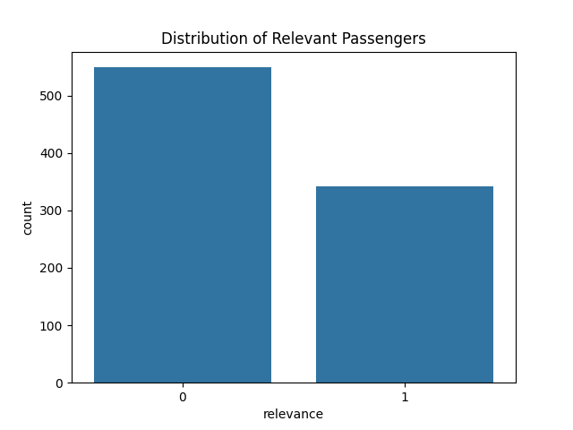

# Titanic Passenger Relevance Analysis
Classifies Titanic passengers as relevant or not for a business evacuation priority list.

## Overview
This project analyzes Titanic passenger data to predict relevance (1 = relevant, 0 = not relevant) for a hypothetical business evacuation plan, using features like class, gender, and age. It includes EDA, visualization, and a logistic regression model.

## Tools
- Python (pandas, sklearn, matplotlib, seaborn)
- Jupyter Notebook

## How to Run
1. Clone the repo:
   ```bash
   git clone https://github.com/ShashankInsights/Titanic-Relevance-Analysis.git
2. Install dependencies:
   ```bash
   pip install -r requirements.txt
3. Open Titanic_Relevance_Analysis.ipynb and run all cells.

## Key Outputs
- Relevance by class: 
  
- Relevance distribution: 
  
- Model performance: 

## Dataset
- Source: [Kaggle](https://www.kaggle.com/c/titanic/data) Titanic Dataset

## Author
[Shashank](https://linkedin.com/in/linkedin.com/in/shashank-mn99)
